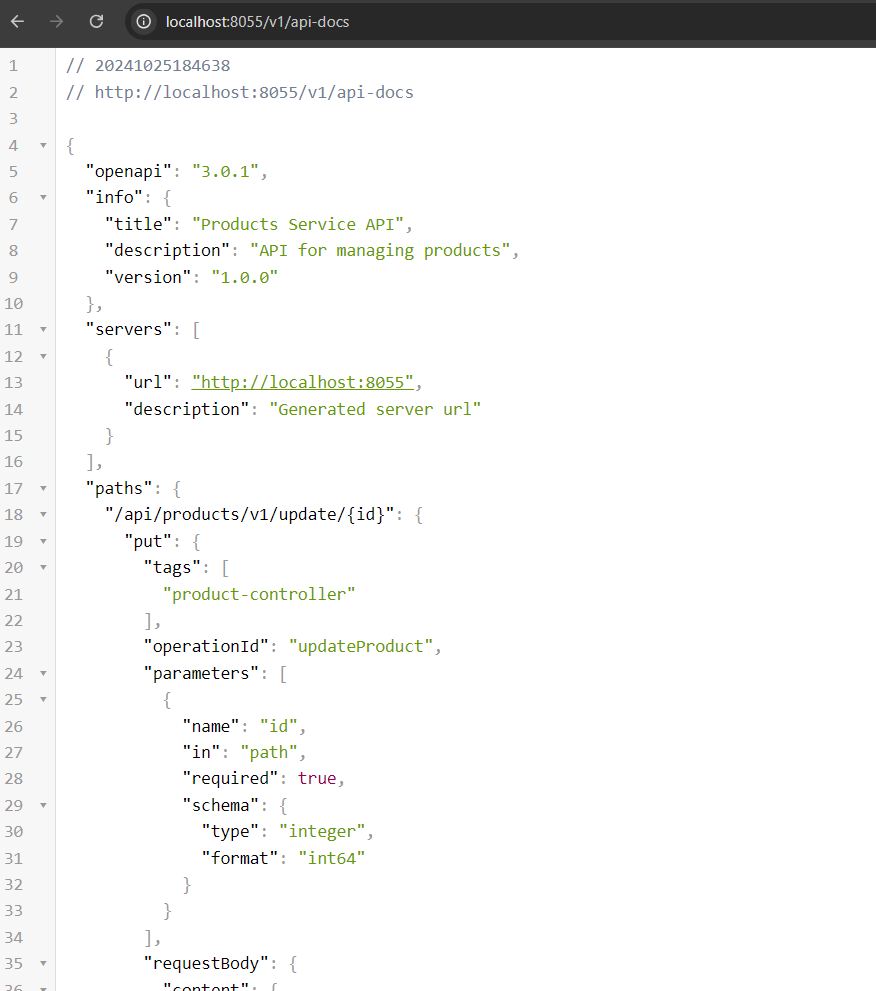

# Product Management System 

## Objective
    [Go to see examples and explanation about Product Management System](#example-pages)  
This system consists of two Spring Boot projects: one for the backend (REST API) and the other for the frontend using JSF with PrimeFaces. The goal is to implement a full-featured product management system allowing users to perform CRUD operations on products through a user-friendly web interface.

## Project Overview 

### 1. Backend Project (Spring Boot, Spring Data JPA, Spring REST) 

- **Framework:** Spring Boot
- **Database Interaction:** Spring Data JPA
- **API Documentation:** OpenAPI
- **Error Handling:** @ControllerAdvice for global error handling
- **Caching:** @Cashable Implemented 
- **Logging:** SLF4J/Logback for logging
- **Build Tool:** Maven

#### Features

- **Product Entity:**
  - Fields: `id`, `name`, `description`, `price`
  - RESTful APIs for product management (Create, Read, Update, Delete)
- **Error Handling:**
  - Custom exception handling using `@ControllerAdvice`.
  - Defined global error responses.
- **OpenAPI:** Integrated for API documentation.
- **Caching:** Improved performance by caching product listings.

### 2. Frontend Project (JSF, PrimeFaces, Spring Boot) 

- **Framework:** JSF, PrimeFaces with Spring Boot
- **UI Components:** PrimeFaces for rich UI components
- **Backend Integration:** WebClient used to communicate with backend REST APIs
- **Build Tool:** Maven

#### Features

- **Pages:**
  - `product.xhtml`: Lists all products.
  - `error.xhtml`: Something went wrong!.
  - `error-404.xhtml`: Page Not Found.
  - `error-500.xhtml`: Internal Server Error.
  
### Example Pages

  - **Product Listing Page (`product.xhtml`): **
    - Displays a table of products with options to edit or delete.
    - Implements pagination and sorting.
    - Add button to add new product
    
  - **Add New Product   **
    - From add button at the bottom of the page we can add new product.  
    - It loaded automatically when close the add new product dialog.  
    

  - **Edit Product **
    - From edit button we can edit product.  
    - It loaded automatically when close the edit product dialog.  
    
    
- **Delete Product Confirmation **
    - Popup dialog for confirming the deletion of a product.
    - It loaded automatically when close the edit product dialog.  
    

  - **Exception Handling **
    - Add GlobalException to handle the ProductService's exception.
      1. Handle the exception for delete product depends on unfound product-ID
        
      2. Handle the exceptions that are generating from Invalid input.
        
      1. Handle the exception for update product depends on unfound product-ID
        
- **logging using SLF4J **
    - Using SFL44J to handle log messages.  
    

- **Casing **
    - Add cashing consept for our ProductService.
    - here it's not a best choice for cashing data, I used it for just testing.
    

- **OpenApi **
  - Using OpenApi for auto documentation generating for our ProductService.
    
    
## Future Plan 
- Add SpringSecurity using JWT for ProductService Project.
- Add singup page and approval page for ProductService users.
## Architecture 

The system follows a clean separation of concerns:

- **Backend:** Provides RESTful services for product management.
- **Frontend:** Handles user interactions and communicates with the backend via HTTP calls (WebClient).

## Build and Run Instructions 

### Prerequisites

-  Java 17
-  Maven
-  Tomcat
-  Intillij
-  A running MySQL/PostgreSQL database for product data.
